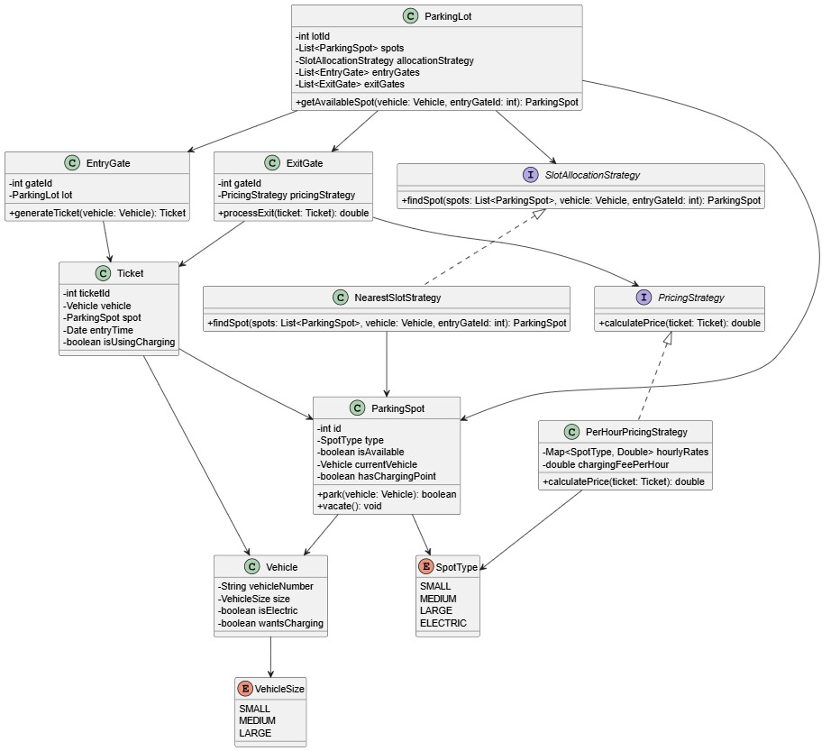

# ATM Machine Simulation

This project demonstrates the implementation of an **ATM Machine** simulation using **Object-Oriented Design Principles** and various **Design Patterns** in Java. The project follows clean code architecture, modular structure, and extensibility for future features.

---

## Table of Contents

* [Overview](#overview)
* [Approach](#approach)
* [Implemented Design Patterns](#implemented-design-patterns)
* [UML Diagram](#uml-diagram)
* [How to Run](#how-to-run)

---

## Overview

The ATM simulation is designed to handle:

* User authentication
* Transactions like **Cash Withdrawal** and **Balance Inquiry**
* State management of ATM operations
* Cash dispensing logic with denomination handling

It emphasizes **design reusability**, **loose coupling**, and **maintainability**.

---

## Approach

1. **Defined Enums** for `CashType` and `TransactionType` to clearly represent constants.
2. **Created State Interface** with concrete implementations (`IdleState`, `CardInsertedState`, etc.) to represent each ATM state.
3. **Implemented Strategy for Cash Dispensing** using a chain-like approach where each dispenser handles one denomination.
4. **Used Context Class (`ATMContext`)** to manage current state and delegate actions to respective state classes.
5. **Encapsulated Logic** for card validation, PIN entry, and balance check to separate responsibilities.
6. Followed **step-by-step modular coding**: starting from Enums → State Pattern → Context → Cash Dispenser → Transaction Flow.

---

## Implemented Design Patterns

* **State Pattern**: To handle different states of ATM (Idle, Card Inserted, PIN Verified, Transaction).
* **Strategy Pattern (Cash Dispensing)**: Different strategies for dispensing cash using denominations.
* **Enum Pattern**: For managing constants like `CashType` and `TransactionType`.

---

## Project Structure

```
ATM-Simulation/
│
|
|── CashType.java
│── TransactionType.java
│── ATMState.java
├── IdleState.java
├── CardInsertedState.java
├── PinVerifiedState.java
└── TransactionState.java
│── ATMContext.java
│── CashDispenser.java
│── HundredDispenser.java
│── FiftyDispenser.java
│── ... (other denominations)
│── Main.java
```

---

## UML Diagram



---

## How to Run

1. Clone this repository.
2. Compile the project:

   ```bash
   javac Main.java
   ```
3. Run the project:

   ```bash
   java Main
   ```

---

